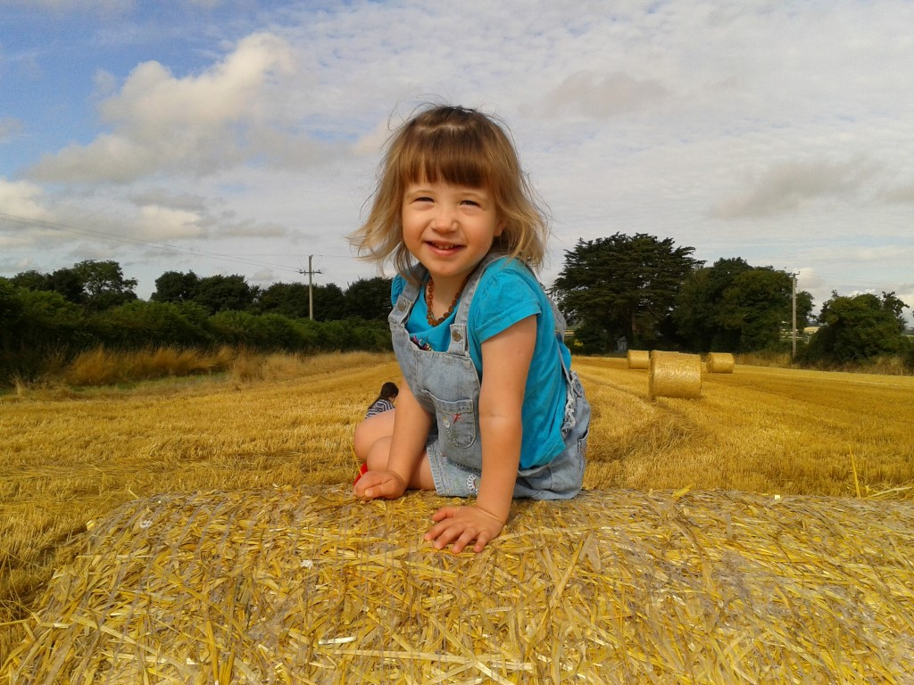

### Azure Cognitive Services Computer Vision (Student Guide)

This guide is aimed at students who have an Azure account and would like to try analysing images with Cognitive Services Computer Vision.

#### Prerequisites:
 * An Azure subscription (Student subscription is fine)
 * Any computer and operating system
 * Python
 * Visual Studio Code
   * VS Code extensions:
     * Python from Microsoft ```ms-python.python```
 * Source image(s) you wish to analyse

### Activate Azure Subscription
If you are a student, you can avail of Azure for Students (or Azure for Students Starter if you are high school or secondary student). Azure for Students lasts for 12 months and comes with $100 in Azure credits.

[Activate Azure for Students](https://azure.microsoft.com/free/students/)

### Set up dev environment
In this example, I'm using Windows 10 and Python 3.9.0 (released Oct. 5, 2020).

#### Install Visual Studio Code & Python
Follow the steps [Getting Started with Python in VS Code](https://code.visualstudio.com/docs/python/python-tutorial). If you successfully complete these, you will have Python installed and an IDE configured to work with it.

#### Creating an Azure Cognitive Services Computer Vision service
Follow the steps at [Quickstart: Create a Cognitive Services resource using the Azure portal](https://docs.microsoft.com/en-us/azure/cognitive-services/cognitive-services-apis-create-account?tabs=singleservice%2Cwindows). Ensure you select *Single-service resource* and *Computer vision*. For Location, students should choose their closest location on the list, for students in Ireland, that is **North Europe**. For *Pricing tier*, select the Free option, unless you have some credit (this service is cheap but remember other services can use up a lot of your credit quickly if you forget to turn them off).

Finally, when the service is created it will give you access to a *key* and an *endpoint*. Copy both of these and store them locally for use in your code on the next step. 

#### Calling Computer Vision service
Using an administrator command prompt (or PowerShell):
1. Create a new folder for your workspace
2. Navigate to that folder 
3. Configure a virtual Python workspace
4. Launch Visual Studio Code

```PowerShell 
C:\> md code
C:\> cd code
C:\code> py -3 -m venv .venv
C:\code> .venv\scripts\activate
(.venv) C:\code> code .
```
In VS Code, you may be prompted to install PyLint etc. in your new virtual Python instance, install these first.

Add a new folder to the workspace: Press ```F1``` or ```CTRL + SHIFT + P``` to open the command palette and then ```>File: New Folder``` (just typing ```New Fo``` is probably enough to reveal the command) and then select it from the list of options and press ```enter```. 

Call the folder ```images``` and then ```ALT + SHIFT + R``` to reveal the folder in Explorer. Copy some images in to analyse. Ensure that each image is:
 * A JPG or PNG
 * Under 4MB in size

I named the files 1.jpg, 2.jpg etc. simply to make it easier to remember the names, but you can call them anything.

#### Python code
Now create a new file in your working folder (```CTRL + N```) and save it ```CTRL + S``` with the name ```whatis.py```.

Edit the file and add the following code:
```python
import requests
import os.path
import sys

# Refer to https://code.visualstudio.com/docs/python/debugging for advice with debugging Python
# This is a much simplfied version of https://docs.microsoft.com/en-us/azure/cognitive-services/computer-vision/quickstarts/python-analyze

# Add your 32 character Computer Vision subscription key and endpoint to your environment variables.
subscription_key = '00000000000000000000000000000000'
endpoint = "https://?????????.cognitiveservices.azure.com/"
# The general model was v2.0, uncomment this and comment out the v3.1 below to try it
# analyze_url = endpoint + "vision/v2.0/analyze"
# The new VIVO api is v3.1 - paper here: https://www.microsoft.com/en-us/research/blog/novel-object-captioning-surpasses-human-performance-on-benchmarks/
analyze_url = endpoint + "vision/v3.1/analyze"

# Edit launch.json to add "args" : ["./images/1.jpg"] when running in debugger, this passes the command line argument to the program
if len(sys.argv) < 2:
    print("Usage: py whatis.py file.jpg")
    raise SystemExit

# input file is the command line argument
inputfile = sys.argv[1] 
# split the file into it's name and extension (eg. filename and .jpg)
fileext = os.path.splitext(inputfile)
# If the input argument is a file
if os.path.isfile(inputfile):
    # If the extenstion is a jpg or png
    if fileext[1] == ".jpg" or fileext[1] =='.png':
        # If the file is smaller than 4MB
        if os.path.getsize(inputfile) < 4194304:
            # Read the image into a byte array
            image_data = open(inputfile, "rb").read()
            # Set the headers for the RESTful API call
            headers = { 'Ocp-Apim-Subscription-Key': subscription_key, 'Content-Type': 'application/octet-stream' }
            # If you specify just Description (or Tags etc.) then only that response will come back. Asking for lots here
            params = {'visualFeatures': 'Categories,Description,Tags,Objects'}
            response = requests.post(analyze_url, headers=headers, params=params, data=image_data)
            response.raise_for_status()

            # The 'analysis' object contains various fields that describe the image. The most
            # relevant caption for the image is obtained from the 'description' property.
            analysis = response.json()
            # Uncomment the print below to see the raw json returned
            # print(analysis)    
                        
            try:
                vision_caption = "Vision AI sees: "
                vision_caption += analysis["description"]["captions"][0]["text"].capitalize()
                vision_caption += " (" + str(round(analysis["description"]["captions"][0]["confidence"] * 100, 1)) + "%)"    
            except IndexError:
                vision_caption = "Nothing!"                        
            print(vision_caption)

            # Iterate over the categories and add them underneath caption
            vision_category =  ""
            for c in analysis["categories"]:
                vision_category += c["name"] + " (" + str(round(c["score"] * 100, 1)) + "%), "            
            print("Categories: " + vision_category);

            # Tags interesting too...
            vision_tags = "Tags: "    
            for tag in analysis["tags"]:
                vision_tags += tag["name"] + " (" + str(round(tag["confidence"] * 100, 1)) + "%), "
            print(vision_tags);
        else:
            print("Please specify a file that is 4MB or smaller.")
    else:
        print("Please specify a JPEG or PNG file.")
else:
    print("Please specify a file that exists")
```

*Remember to add the key and endpoint that you should have saved from Azure Portal near the top of the file - this won't work if you skipped that step.*

#### Running/Debugging
Now press ```F1``` and ```Debug: Open launch.json```. This opens the file where you can configure how VS Code should run or debug your Python program.
Add a line at the bottom (add a comma on the end of line before) to add ```"args" : ["./images/1.jpg"]```, change the folder name and the file name to the name of your images folder (and any image file in it). This tells Python which file to work with. 
Your ```launch.json``` will look something like this: 
```json
{
    // Use IntelliSense to learn about possible attributes.
    // Hover to view descriptions of existing attributes.
    // For more information, visit: https://go.microsoft.com/fwlink/?linkid=830387
    "version": "0.2.0",
    "configurations": [
        {
            "name": "Python: Current File",
            "type": "python",
            "request": "launch",
            "program": "${file}",
            "console": "integratedTerminal",
            "args" : ["./images/1.jpg"]
        }
    ]
}
```
Remember to save it ```CTRL + S```, close it and return to the ```whatis.py``` file.

#### Output
Now it's time to run the code, ensure ```whatis.py``` is saved, and press ```F5```. The IDE should open a new terminal if one is not already open, and print out what is in the image passed as a command line argument. 

In my case, the output was:
```console
Vision AI sees: A child sitting in a field of wheat (43.0%)
Categories: people_ (82.4%),
Tags: grass (100.0%), sky (99.6%), outdoor (99.5%), person (99.2%), little (98.8%), young (96.6%), child (93.1%), human face (92.7%), clothing (85.5%), girl (83.2%), smile (82.0%), boy (79.7%), toddler (53.7%), corn (49.8%), plant (38.8%),
PS C:\code> 
```
and the input file was:


### Conclusion
This is a quick and simple way to query the Azure Cognitive Services Computer Vision services. There's a lot more you can do and learn with Cognitive Services, and this is a good starting point. Hope you've found this useful, if you are a lecturer in Ireland / Northern Ireland and interested in a guest lecture on Azure Cognitive Services, please email me on stephen.howell@microsoft.com. If you're a student and you find this useful, please Star the repo.
